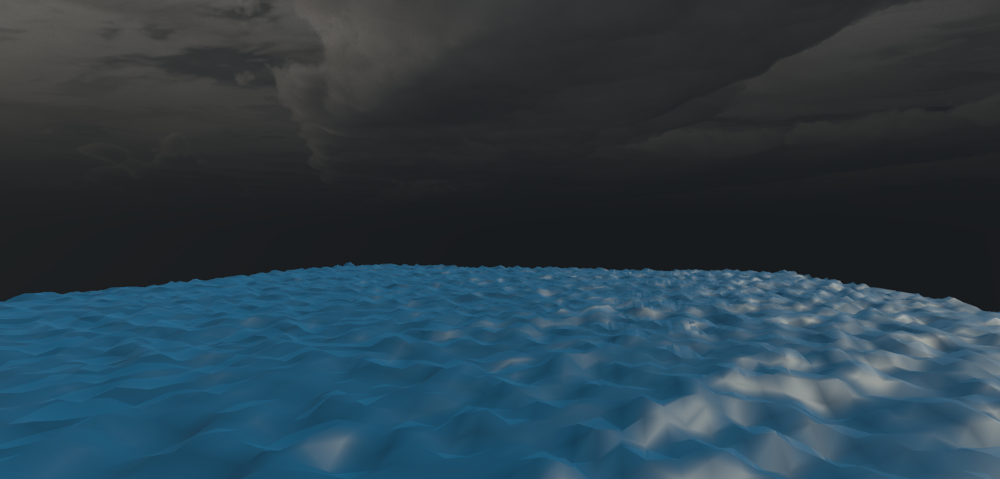

# Wave Generator

The goal of this project is to create a Wave Generator in Unity.

It supports both straight sine waves as well as more accurate Gerstner waves.

How it works:
- Generate a mesh of a specific size.
- Through the use of Perlin noise, update each Y co-ordinate of the grid so that an interesting surface is created.
- Update each vertex in the generated mesh each frame using a Gerstner wave function.
- User is able to manipulate two sliders to change the waveform in real time. Other sliders are available at generation time but can only be accessed through the Unity editor.

## Demonstration

